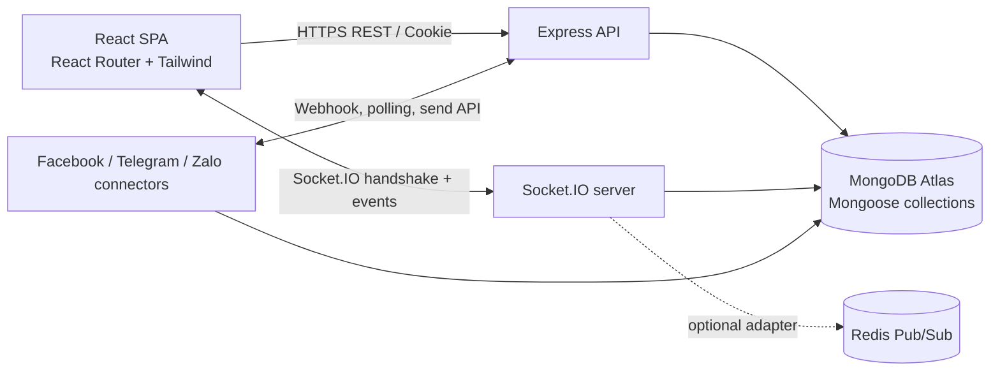
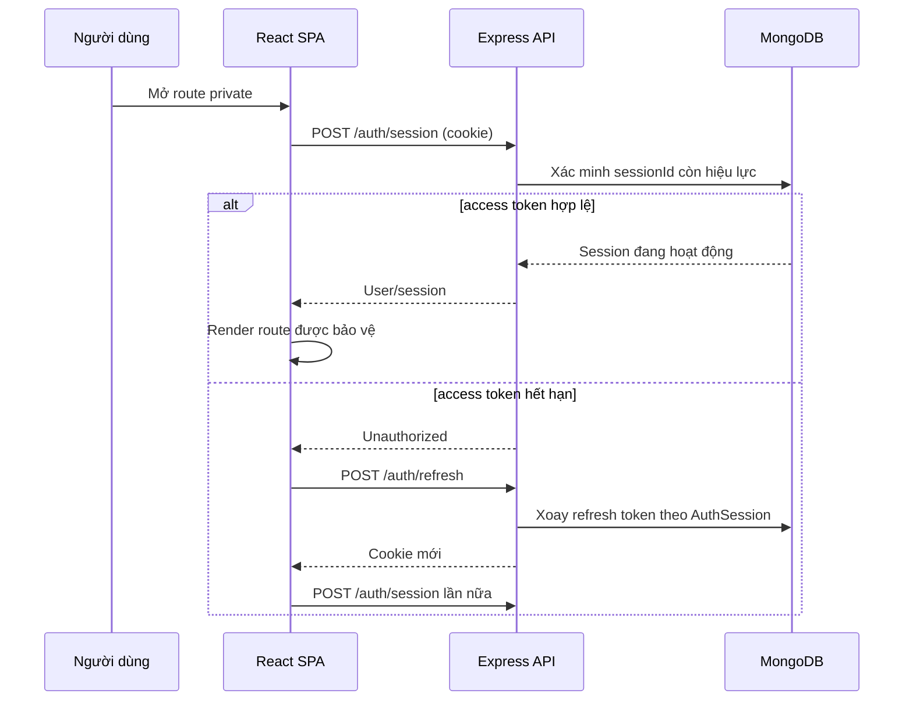
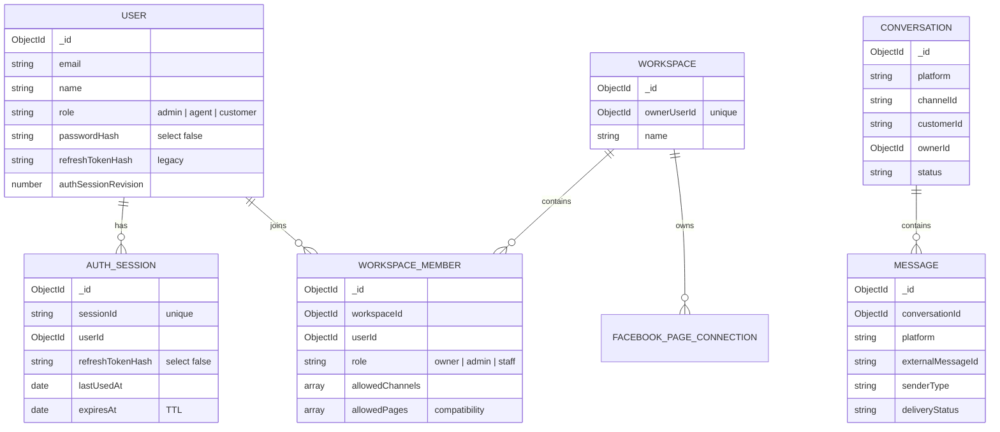
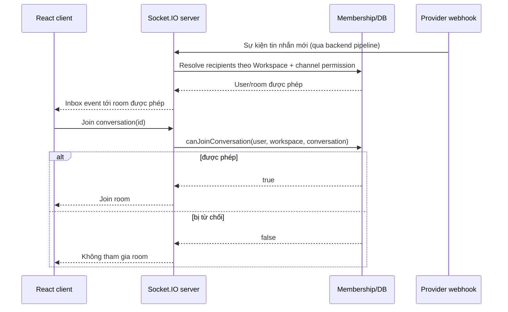

# Báo cáo đồ án tốt nghiệp: Hệ thống quản lý hội thoại khách hàng đa kênh Nhuu-chat

> **Phạm vi và tính xác thực:** Báo cáo này được biên soạn từ mã nguồn và cấu hình hiện có trong repository. Các thông tin về trường, khoa, giảng viên, sinh viên và thời gian thực hiện được để dạng chỗ trống vì chưa có dữ liệu xác minh. Báo cáo mô tả kiến trúc đã quan sát được; các tính năng chỉ có trong PRD/SRS nhưng chưa hiện diện trong source không được xem là đã hoàn thành. Trạng thái production của từng tích hợp phụ thuộc credential, cấu hình và nghiệm thu với nhà cung cấp.

## Thông tin đồ án

| Trường thông tin | Nội dung |
|---|---|
| Tên đề tài | Xây dựng hệ thống quản lý hội thoại khách hàng đa kênh Nhuu-chat |
| Sinh viên thực hiện | `[Bổ sung họ tên]` |
| Mã sinh viên / lớp | `[Bổ sung]` |
| Ngành / khoa | `[Bổ sung]` |
| Giảng viên hướng dẫn | `[Bổ sung]` |
| Đơn vị thực tập (nếu áp dụng) | `[Bổ sung]` |
| Thời gian thực hiện | `[Bổ sung theo thời gian thực tế]` |

## Tóm tắt

Nhuu-chat là ứng dụng web hỗ trợ doanh nghiệp tập trung các cuộc hội thoại khách hàng từ nhiều kênh vào một Inbox. Mã nguồn hiện triển khai frontend dạng SPA bằng React, TypeScript, Vite và Tailwind CSS; backend dùng Node.js, Express và TypeScript; MongoDB/Mongoose quản lý dữ liệu; Socket.IO truyền sự kiện realtime. Hệ thống có xác thực dựa trên access/refresh token trong cookie HttpOnly, quản lý phiên riêng theo lần đăng nhập/thiết bị, phân quyền Workspace với các vai trò owner/admin/staff và quyền truy cập theo kênh. Các connector đã hiện diện trong source gồm Facebook Messenger, Telegram Bot, Telegram cá nhân và Zalo cá nhân thử nghiệm; phạm vi gửi/nhận khác nhau theo nền tảng.

Báo cáo tập trung vào kiến trúc xác thực nhiều phiên, bảo vệ route, quyền Workspace/Page/kênh và sự phối hợp giữa REST API với Socket.IO. Một điểm cần phân biệt rõ khi đọc mô hình dữ liệu là `allowedPages` không phải thuộc tính trực tiếp của User: quan hệ thành viên Workspace nằm ở collection `WorkspaceMember`; danh sách kênh mới được biểu diễn tổng quát bằng `allowedChannels`, còn `allowedPages` được duy trì để tương thích với dữ liệu/quyền Facebook cũ. Tương tự, refresh token theo thiết bị không được lưu dưới dạng một mảng `refreshTokens` trong User mà được tách thành từng tài liệu `AuthSession`.

**Từ khóa:** Omnichannel, React, Express, MongoDB, xác thực nhiều thiết bị, RBAC, Workspace, Socket.IO.

## 1. Mở đầu

### 1.1 Bối cảnh

Khách hàng thường liên hệ doanh nghiệp qua nhiều kênh khác nhau. Khi nhân viên phải mở từng ứng dụng riêng, việc theo dõi tin chưa đọc, lịch sử trao đổi và trách nhiệm xử lý bị phân tán. Một Inbox hợp nhất giúp nhân viên quan sát hội thoại theo cùng một luồng nghiệp vụ và giảm việc chuyển đổi giữa các công cụ.

### 1.2 Mục tiêu

- Tổ chức frontend và API theo các miền chức năng như xác thực, Workspace, hội thoại, tin nhắn và kênh kết nối.
- Cung cấp xác thực an toàn và cho phép một tài khoản có nhiều phiên độc lập.
- Cho phép Workspace quản lý thành viên và giới hạn nhân viên vào những Page/kênh được giao.
- Cung cấp cập nhật hội thoại realtime khi có sự kiện phù hợp.
- Hỗ trợ giao diện responsive, có thể phục hồi một số trạng thái điều hướng sau khi tải lại.

### 1.3 Phạm vi và giới hạn

Nội dung được mô tả là phần đã quan sát được trong source. Facebook Messenger có webhook và gửi trả lời văn bản; Telegram, Telegram cá nhân và Zalo cá nhân có connector riêng với trạng thái hoàn thiện khác nhau. Instagram xuất hiện trong mô hình nền tảng và một số cấu trúc quyền, nhưng điều đó không đồng nghĩa đã có adapter gửi/nhận đầy đủ. Zalo cá nhân được ghi nhận là thử nghiệm. Báo cáo không khẳng định mọi connector đã được nghiệm thu với tài khoản production.

Các nội dung như gọi WebRTC hoặc cơ sở dữ liệu vector chỉ được xem là mục tiêu nếu chỉ xuất hiện trong tài liệu yêu cầu mà không có implementation tương ứng. Chúng không được trình bày như chức năng đã triển khai.

## 2. Cơ sở lý thuyết và công nghệ

### 2.1 React và React Router

React xây dựng giao diện từ các component và state. Khi state hoặc props thay đổi, React tính toán phần giao diện cần cập nhật. Ứng dụng web sử dụng React 19 và React Router v6; các route public và private được khai báo trong SPA. `ProtectedRoute` kiểm tra trạng thái đăng nhập ở phía client để điều hướng trải nghiệm người dùng, trong khi API vẫn phải xác minh access token và quyền ở backend. Route guard frontend không phải ranh giới bảo mật thay cho server.

### 2.2 Node.js, Express và TypeScript

Node.js thực thi JavaScript ở phía server theo mô hình event-driven, phù hợp với API I/O-bound và kết nối realtime. Express cung cấp router, middleware và error handling. TypeScript bổ sung kiểu tĩnh giúp mô tả request, domain và service contract trong quá trình phát triển; kiểu tĩnh không thay thế validation dữ liệu đầu vào ở runtime.

Trong repository, API là ứng dụng Express 5 viết bằng TypeScript. `app.ts` đăng ký middleware bảo mật, request ID, CORS/origin protection, parser body và các router theo miền. `server.ts` khởi tạo kết nối cơ sở dữ liệu, các client nền cần thiết và Socket.IO.

### 2.3 MongoDB và Mongoose

MongoDB lưu tài liệu JSON-like trong collection; phù hợp với dữ liệu hội thoại, tin nhắn và cấu hình có cấu trúc mở rộng theo nền tảng. Mongoose cung cấp schema, validation, index và các thao tác truy vấn cho TypeScript/Node.js.

Các quan hệ quan trọng được giữ bằng ID tham chiếu, ví dụ Conversation liên kết Message qua `conversationId`, và thành viên liên kết Workspace với User qua `workspaceId`, `userId`. Index duy nhất được dùng cho các định danh/quan hệ cần tránh bản ghi trùng; index không tự đảm bảo mọi quy tắc nghiệp vụ nên service vẫn cần kiểm tra quyền và tính hợp lệ.

### 2.4 Tailwind CSS

Tailwind CSS là hệ utility-first: style được ghép trực tiếp từ các class trong JSX. Dự án dùng Tailwind CSS v4 qua plugin chính thức cho Vite; entry stylesheet nằm ở `apps/web/src/styles/tailwind.css`. Utility classes hỗ trợ breakpoint responsive và giúp style component nằm gần markup. Quy tắc mobile đặt cỡ chữ tối thiểu 16px cho input/select/textarea ở viewport hẹp nhằm tránh hiện tượng Safari iOS tự phóng to input khi focus.

### 2.5 Vite

Vite phục vụ môi trường phát triển nhanh và đóng gói frontend cho production. Cấu hình dự án dùng React plugin và Tailwind Vite plugin; dev server proxy `/api` và `/socket.io` về API cục bộ để tránh phải cấu hình URL khác nhau cho từng request khi phát triển. Build frontend được chạy bằng script của workspace `web`.

### 2.6 Socket.IO

Socket.IO cung cấp kết nối hai chiều dựa trên event, có cơ chế reconnect và room. Nhuu-chat xác thực handshake bằng thông tin phiên, sau đó giới hạn việc tham gia room theo quyền. Redis adapter được cấu hình tùy chọn khi có `REDIS_URL`, phục vụ fan-out giữa nhiều API process; khi không có cấu hình này, adapter phân tán không được bật.

## 3. Phân tích yêu cầu và thiết kế hệ thống

### 3.1 Tác nhân và yêu cầu chính

| Tác nhân | Trách nhiệm chính |
|---|---|
| Khách hàng | Gửi tin nhắn qua kênh kết nối; không truy cập giao diện quản trị Inbox |
| Nhân viên (agent/staff) | Xem và xử lý hội thoại thuộc phạm vi tài khoản/Workspace và kênh được cấp |
| Quản trị viên Workspace | Quản lý vận hành Workspace theo quyền được cấp; có phạm vi kênh đầy đủ theo mô hình hiện tại |
| Chủ sở hữu Workspace | Kết nối kênh và quản lý thành viên Workspace; bản ghi owner được bảo vệ khỏi chỉnh sửa/xóa qua API quản lý thành viên |
| Dịch vụ connector | Nhận webhook/polling hoặc gửi tin tới nền tảng bên ngoài, tùy connector |

Yêu cầu phi chức năng gồm xác minh quyền ở backend, không đưa token bí mật vào frontend, xử lý lỗi có thể quan sát được, hỗ trợ reconnect và duy trì khả năng điều hướng trên thiết bị di động.

### 3.2 Kiến trúc tổng thể



Frontend phụ trách điều hướng, hiển thị và tương tác. Backend là nơi có thẩm quyền cuối cùng đối với danh tính, membership, quyền kênh và thao tác dữ liệu. MongoDB là persistence chính; Redis adapter là tùy chọn cho Socket.IO khi triển khai nhiều process.

### 3.3 Luồng xác thực và Auth Guard

1. Người dùng đăng nhập bằng email/mật khẩu. Backend kiểm tra mật khẩu băm bằng bcrypt và tạo phiên đăng nhập riêng.
2. Backend phát access token thời hạn ngắn và refresh token thời hạn dài hơn; token được chuyển qua cookie HttpOnly theo cấu hình cookie. Cookie được cấu hình SameSite và Secure ở production.
3. Frontend khởi tạo session bằng `POST /api/v1/auth/session`. Nếu phiên access hết hạn, frontend thử refresh rồi tải session lại.
4. `ProtectedRoute` hiển thị trạng thái chờ trong lúc bootstrap; nếu không xác thực được thì điều hướng tới trang đăng nhập. Đây là guard UX; mọi API private vẫn chạy middleware xác thực độc lập.
5. Middleware backend lấy token từ cookie hoặc Bearer header, xác minh chữ ký/claims và kiểm tra session tương ứng còn hoạt động.



### 3.4 Đăng nhập nhiều thiết bị

Trong mô hình triển khai, mỗi lần đăng nhập tạo một tài liệu `AuthSession` riêng. Tài liệu gồm `sessionId`, `userId`, hash refresh token, `lastUsedAt` và `expiresAt`; hash được đánh dấu không trả ra mặc định. `sessionId` có unique index, `userId` có index và `expiresAt` dùng TTL index để dọn phiên hết hạn theo cơ chế MongoDB.

Khi refresh, backend kiểm tra hash gắn với session hiện tại và xoay hash theo cơ chế cập nhật có điều kiện. Logout xóa/revoke session hiện tại, không cần vô hiệu hóa phiên trên thiết bị khác. Khi reset mật khẩu, dịch vụ cập nhật thông tin bảo mật và xóa các session để buộc đăng nhập lại. Vì vậy, **mã nguồn hiện tại không dùng mảng `refreshTokens` trong User làm kiến trúc chính**. Trường `refreshTokenHash` trên User được giữ như nhánh tương thích cũ trong quá trình chuyển đổi.



### 3.5 Mô hình dữ liệu người dùng và quyền Workspace

Collection `User` lưu danh tính đăng nhập và cài đặt thuộc người dùng: email, tên, password hash, role hệ thống (`admin`, `agent`, `customer`), thông tin tương thích refresh token và cấu hình cá nhân. Schema `User` không khai báo `allowedPages`.

Quyền Workspace được tách thành các collection:

- `Workspace`: chủ sở hữu và tên Workspace; hệ thống có thể tạo Workspace cá nhân để bao bọc dữ liệu cũ.
- `WorkspaceMember`: quan hệ giữa User và Workspace, vai trò Workspace và quyền kênh.
- `allowedChannels`: danh sách tham chiếu theo cặp platform/channelId, dùng thống nhất cho Facebook, Instagram, Zalo, Telegram và các kênh cá nhân được hỗ trợ.
- `allowedPages`: trường tương thích cũ cho Facebook Page. Service ánh xạ nó thành quyền kênh Facebook khi cần đọc dữ liệu cũ.

Do đó, nếu đề bài/biểu mẫu yêu cầu nói về “Users với allowedPages”, báo cáo kỹ thuật cần chỉnh lại cách diễn đạt: **quyền không nằm trên User; nó gắn với membership của Workspace**. Cách tách này cho phép user có membership ở nhiều Workspace và tránh trộn quyền hệ thống với quyền của tổ chức.

### 3.6 Mô hình RBAC động và lọc dữ liệu

Vai trò hệ thống (`User.role`) phục vụ các quyền cấp ứng dụng cũ; vai trò Workspace (`owner`, `admin`, `staff`) quyết định hành động trong Workspace. Middleware đọc `x-workspace-id`, xác minh membership của user, sau đó tạo ngữ cảnh Workspace cho route/service. Khi không có Workspace được chọn nhưng user thuộc nhiều Workspace, API yêu cầu chọn Workspace thay vì tự lấy một Workspace không rõ ý định.

Quyền kênh không được quyết định bằng một Page ID hardcode. Backend xây điều kiện truy vấn từ Workspace và membership:

- Owner/admin được truy cập các kênh thuộc Workspace.
- Staff có `allowedChannels` khác rỗng chỉ truy cập các cặp platform/channelId đã được cấp.
- Danh sách quyền rỗng được hiểu là không giới hạn theo quy ước hiện hành của service.
- `allowedPages` cũ được ánh xạ vào danh sách Facebook channel tương ứng.
- Mọi truy vấn phải tiếp tục giới hạn theo owner/Workspace; chỉ lọc `channelId` mà bỏ owner scope là không đủ an toàn.

```text
member = lookupMembership(workspaceId, authenticatedUser.id)
assert member exists

if member.role in [owner, admin] or member.allowedChannels is empty:
    channelScope = allChannelsOwnedBy(workspace.ownerUserId)
else:
    channelScope = channelsMatching(
        workspace.ownerUserId,
        member.allowedChannels as (platform, channelId) pairs
    )

conversations = findConversations({
    ownerId: workspace.ownerUserId,
    ...channelScope
})
```

Quyền được dùng cả khi lấy danh mục kênh, hội thoại, khi join Socket.IO conversation room và khi phát sự kiện Inbox tới người nhận. Đây là điểm cần giữ nhất quán: ẩn một Page ở frontend không thay thế lọc backend.

### 3.7 Realtime bằng Socket.IO

Trong handshake, server lấy cookie hoặc token, xác minh user/session và Workspace được chọn. Server lưu context quyền vào socket, gắn socket với room định danh phù hợp và chỉ chấp nhận join conversation nếu hàm kiểm tra quyền xác nhận đúng owner/kênh. Khi có sự kiện Inbox, danh sách người nhận được xác định từ membership và quyền kênh trước khi emit.

Khi người dùng đổi Workspace ở frontend, ứng dụng cập nhật Workspace đang hoạt động, xóa dữ liệu hiển thị gắn với Workspace cũ, xóa lựa chọn hội thoại/bộ lọc phù hợp và cleanup socket cũ để tạo socket mới theo Workspace. Đây là luồng SPA; không cần browser hard reload để chuyển Workspace. Redis adapter chỉ được bật nếu có cấu hình URL Redis.



### 3.8 Tối ưu và phục hồi trạng thái mobile

Ứng dụng dùng URL cho các trạng thái định danh/navigable: route hiện tại, tab cài đặt thông qua đường dẫn và hội thoại qua query `conversationId`. Workspace đang chọn được lưu trong local storage theo user; một số trạng thái giao diện tạm thời như danh sách hội thoại/sidebar mobile và bộ lọc nền tảng dùng session storage. Các key lưu trữ phải được đọc có kiểm tra và đồng bộ với URL để tránh khôi phục hội thoại không thuộc Workspace hiện tại.

Ở viewport nhỏ, input/select/textarea có cỡ chữ tối thiểu 16px nhằm tránh zoom tự động của Safari khi focus. Danh sách hội thoại và khung chat có trạng thái mobile riêng; người dùng có thể quay về danh sách mà không thay đổi quyền server. Lưu trữ UI giúp khôi phục sau khi tab bị tải lại, nhưng không thể ngăn trình duyệt hủy tab khi thiếu bộ nhớ. Khi tab được dựng lại, session xác thực và quyền vẫn phải được xác minh qua API.

Các thư viện query cache như React Query/SWR không được khai báo trong dependencies hiện tại. Do đó, báo cáo không gán hành vi refetch khi focus cho một query client toàn cục. Reconnect Socket.IO là một phần vận hành riêng; reconnect không được xem là lý do để reload toàn trang.

## 4. Triển khai, an toàn và vận hành

### 4.1 Các miền backend

API được chia theo miền trong `apps/api/src`: auth, workspaces/members, conversations/messages, Facebook Page, Telegram, Zalo cá nhân, tags, quick replies, assistant/knowledge và lịch sử cài đặt. Middleware đảm nhiệm xác thực, role hệ thống, Workspace context, rate limit và kiểm soát request. Service chứa quy tắc nghiệp vụ, model mô tả persistence.

### 4.2 Bảo vệ dữ liệu

- Password được lưu dưới dạng hash, không lưu password rõ.
- Hash refresh token được lưu riêng theo AuthSession; token nhạy cảm không trả ra mặc định từ truy vấn model.
- Cookie auth đặt HttpOnly; Secure được bật trong production theo cấu hình.
- Page/provider secrets được xử lý ở backend và một số credentials connector được mã hóa at rest theo cơ chế trong source.
- API private xác minh danh tính/quyền tại server; client không được tự gửi `ownerId` để quyết định phạm vi dữ liệu.
- Webhook Facebook xác minh chữ ký theo implementation hiện có; webhook Telegram có secret và cơ chế idempotency theo README.
- Token, API key, password và cookie không được đưa vào báo cáo, log hay commit.

### 4.3 Triển khai môi trường

README mô tả kiến trúc local/prod: frontend Vite, API Express, MongoDB Atlas và Redis tùy chọn; deploy hiện hướng tới Vercel/Railway theo tài liệu deployment. Việc deploy hay migration production phải tuân theo backup, dry-run và xác nhận operator đã ghi trong hướng dẫn tương ứng. Báo cáo này không xác nhận rằng migration production hoặc nghiệm thu live đã được thực hiện.

## 5. Kiểm thử và đánh giá

### 5.1 Các lớp kiểm thử phù hợp

- Unit test service: quy tắc membership, mapping allowedPages cũ, phạm vi channel filter, token/session rotation.
- API test: thành viên ngoài Workspace bị từ chối; owner/admin/staff nhận đúng phạm vi kênh; logout chỉ thu hồi phiên hiện hành.
- Socket test: handshake không có phiên hợp lệ bị từ chối; join room và Inbox event chỉ tới thành viên được phép.
- Frontend test: protected route, khôi phục URL và storage, chuyển Workspace, responsive settings/Inbox.
- Build/typecheck và `git diff --check` trước phát hành.

Các trường hợp trên là ma trận kiểm thử đề xuất để đánh giá các luồng; báo cáo này không khẳng định từng ca đã chạy trong môi trường production. Khi nộp báo cáo chính thức, cần đính kèm kết quả lệnh/test thực tế của commit được nghiệm thu.

### 5.2 Đánh giá kiến trúc

Ưu điểm là session tách độc lập theo lần đăng nhập, quyền Workspace không bị trộn vào role hệ thống, bộ lọc channel tổng quát hóa qua nhiều nền tảng và socket áp dụng kiểm tra quyền. Các giới hạn gồm mức độ hoàn thiện connector không đồng đều, phụ thuộc cấu hình dịch vụ ngoài, Redis adapter tùy chọn, khả năng hỗ trợ của từng nền tảng và việc browser có thể hủy tab khi thiếu RAM. Việc dùng `allowedPages` song song với `allowedChannels` đòi hỏi mapping tương thích được kiểm thử khi migration/đọc dữ liệu cũ.

## 6. Kết luận và hướng phát triển

Nhuu-chat hiện có nền tảng web đa kênh với SPA React, API Express, MongoDB/Mongoose và Socket.IO. Những quyết định kiến trúc quan trọng là: xác thực phiên riêng theo thiết bị; tách User, Workspace và WorkspaceMember; áp dụng cùng quyền kênh ở REST và Socket; lưu trạng thái điều hướng cần phục hồi qua URL/storage.

Hướng phát triển tiếp theo nên ưu tiên: hoàn thiện adapter theo từng nền tảng và kiểm thử live có kiểm soát; quan sát lỗi/retry/queue; kiểm toán quyền đa Workspace; hoàn thiện migration có backup/rollback; kiểm thử thiết bị di động và xác minh khả năng khôi phục sau khi trình duyệt hủy tab. Chỉ đánh dấu một hạng mục hoàn thành khi có source, test và bằng chứng vận hành tương ứng.

## Tài liệu tham khảo nội bộ

- [README dự án](../README.md)
- [Workspace và quyền truy cập Page/kênh](wiki/workspace-page-access.md)
- [PRD](requirements/prd-v2.md) và [SRS](requirements/srs-v2.md) — yêu cầu sản phẩm; cần đối chiếu với source trước khi xem là chức năng đã hoàn thành.
- [User model](../apps/api/src/models/user.model.ts), [AuthSession model](../apps/api/src/models/auth-session.model.ts), [WorkspaceMember model](../apps/api/src/models/workspace-member.model.ts)
- [Auth service](../apps/api/src/services/auth.service.ts), [Workspace access middleware](../apps/api/src/auth/workspace.middleware.ts), [Workspace channel access](../apps/api/src/auth/workspace-channel-access.ts)
- [Realtime access](../apps/api/src/realtime/access.ts), [Socket.IO server](../apps/api/src/realtime/socket.ts)
- [ProtectedRoute](../apps/web/src/components/common/ProtectedRoute.tsx), [App](../apps/web/src/App.tsx), [Tailwind entry](../apps/web/src/styles/tailwind.css)
